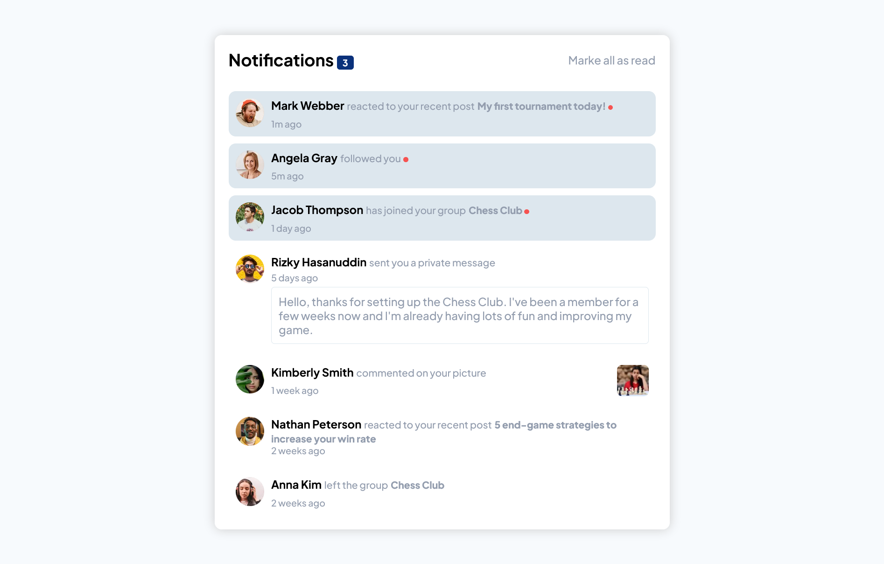

# Frontend Mentor - Notifications page solution

This is a solution to the [Notifications page challenge on Frontend Mentor](https://www.frontendmentor.io/challenges/notifications-page-DqK5QAmKbC). Frontend Mentor challenges help you improve your coding skills by building realistic projects. 

## Table of contents

- [Overview](#overview)
  - [The challenge](#the-challenge)
  - [Screenshot](#screenshot)
  - [Links](#links)
- [My process](#my-process)
  - [Built with](#built-with)
  - [What I learned](#what-i-learned)
  - [Continued development](#continued-development)
  - [Useful resources](#useful-resources)
- [Author](#author)
- [Acknowledgments](#acknowledgments)

## Overview

### The challenge

Users should be able to:

- Distinguish between "unread" and "read" notifications
- Select "Mark all as read" to toggle the visual state of the unread notifications and set the number of unread messages to zero
- View the optimal layout for the interface depending on their device's screen size
- See hover and focus states for all interactive elements on the page

### Screenshot



### Links

- Solution URL: [solution page](https://www.frontendmentor.io/solutions/responsive-notification-page-PXa2uph6pB)
- Live Site URL: [live site click here](https://abdulelah-abacar.github.io/notifications-page-main/)

## My process

### Built with

- Semantic HTML5 markup
- CSS custom properties
- Flexbox
- Mobile-first workflow

### What I learned

- In this challenge I have learned how to use @font-face
```css
@font-face {
  font-family: "Plus Jakarta Sans";
  src: url("assets/fonts/PlusJakartaSans-VariableFont_wght.ttf");
  src: url('assets/fonts/static/PlusJakartaSans-ExtraBold.ttf') format('truetype'),
       url('assets/fonts/static/PlusJakartaSans-Medium.ttf') format('truetype'),
}
```

### Continued development

### Useful resources

- [DigitalOcean](www.digitalocean.com) - This helped me for know how to use @font-face.

## Author

- Frontend Mentor - [@Abdulelah-Abacar](https://www.frontendmentor.io/profile/Abdulelah-Abacar)
- Github - [@Abdulelah-Abacar](https://www.github.com/Abdulelah-Abacar)

## Acknowledgments

